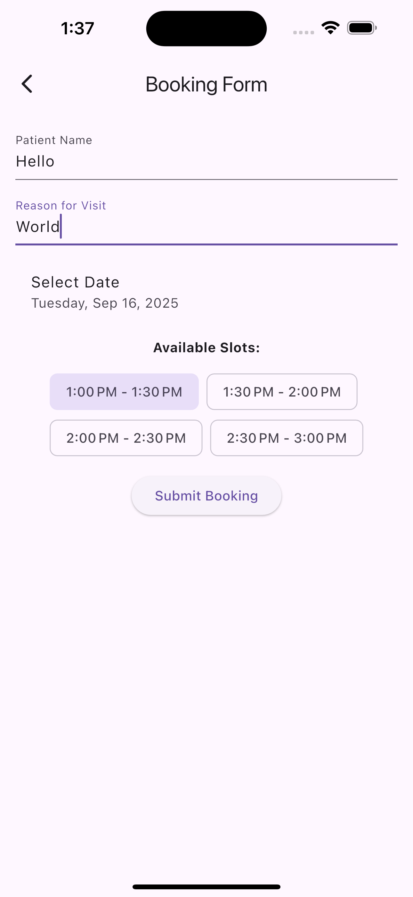

# doctor_booking

A simple Flutter app for booking doctor appointments.

## 📱 Screenshots

<table>
  <tr>
    <td align="center">
      
      <br />Home
    </td>
    <td align="center">
      
      <br />Doctor Detail
    </td>
    <td align="center">
      
      <br />Doctor List
    </td>
  </tr>
  <tr>
    <td align="center">
      
      <br />Bookings
    </td>
    <td align="center">
      
      <br />Doctor List
    </td>    <td align="center">
      
      <br />Booking Form
    </td>
  </tr>
</table>

## 🚀 Getting Started

1. **Clone the repo:**

   ```sh
   git clone https://github.com/Yvntrix/doctor_booking.git
   cd doctor_booking
   ```

2. **Install dependencies:**

   ```sh
   flutter pub get
   ```

3. **Run the app:**
   ```sh
   flutter run
   ```

## 🗂️ Project Structure

- `lib/features/` - All app features (patient, admin, etc.)
- `lib/domain/` - Entities and repositories
- `lib/data/` - Data sources and tables
- `lib/core/` - Routing and core utilities

## 🛠️ Built With

- [Flutter](https://flutter.dev/)
- [Bloc](https://bloclibrary.dev/)
- [Hive](https://pub.dev/packages/hive_ce)
- [GoRouter](https://pub.dev/packages/go_router)
